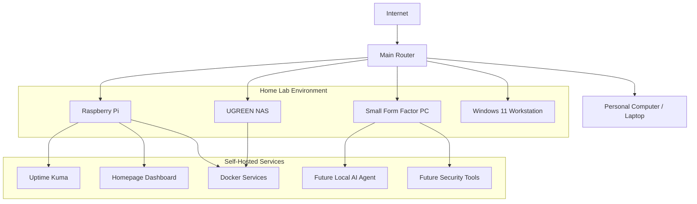

# Home Lab Diagram

## Overview

This document provides a high-level visual overview of my cybersecurity home lab. The diagram is intentionally sanitized and does not include real IP addresses, hostnames, internal URLs, credentials, or sensitive network details.

## High-Level Architecture

## Device Summary

| Component                  | Purpose                                                      |
| -------------------------- | ------------------------------------------------------------ |
| Main Router                | Provides network connectivity for the lab                    |
| Personal Computer / Laptop | Used for administration, documentation, and GitHub updates   |
| Raspberry Pi               | Lightweight server for monitoring and dashboard services     |
| UGREEN NAS                 | Storage and future application hosting                       |
| Small Form Factor PC       | Future virtualization, cybersecurity workloads, and local AI |
| Windows 11 Workstation     | Testing, access, and lab interaction                         |

## Security Notes

This diagram does not include:

* Real IP addresses
* Real hostnames
* Internal URLs
* Wi-Fi details
* Usernames
* Passwords
* API keys
* Tokens
* Employer-owned or confidential information

## Future Improvements

* Add a more detailed segmented network diagram
* Add a Docker service diagram
* Add a local AI architecture diagram
* Add a security monitoring/logging diagram
* Document which services are local-only
* Document future VPN or remote access design
